# Implementation Plan — Smart Patient Queue & Emergency Triage

**Plan Status**: Ready for Phase 1 Execution (Pending User Authorization)  
**Total Phases**: 11 (Phase 0 through Phase 10)  
**Current Phase**: Phase 0 Complete  

---

## Phase Overview

```mermaid
gantt
    title Smart Patient Queue & Emergency Triage Roadmap
    dateFormat  X
    axisFormat  Day %d
    section Blueprint
    Phase 0 - Blueprint & Specifications         :done, p0, 0, 1
    section Foundation & Data
    Phase 1 - Foundation & Backend Scaffold       :active, p1, 1, 2
    Phase 2 - Identity & Registration             :p2, 2, 3
    Phase 3 - Clinical Triage & Safety Engine     :p3, 3, 4
    section Queue & Workflow
    Phase 4 - Dynamic Priority Queue Engine       :p4, 4, 5
    Phase 5 - Consultation & Department Flow      :p5, 5, 6
    Phase 6 - Real-Time Streaming & Alerts        :p6, 6, 7
    section Intelligence & Hardening
    Phase 7 - Operational Analytics & Forecasting :p7, 7, 8
    Phase 8 - Security & Concurrency Hardening    :p8, 8, 9
    section Presentation & Validation
    Phase 9 - UI Integration (Custom Components) :p9, 9, 10
    Phase 10 - End-to-End Testing & Demonstration :p10, 10, 11
```

---

## Phase 0: Project Blueprint, Technical Specifications & Governance (COMPLETED)
- **Status**: Completed.
- **Deliverables**: 50 comprehensive specification documents, 11 architectural diagrams, OpenAPI 3.1 specification, event schemas, example payloads, and project governance documentation.
- **Exit Condition**: Full consistency check passed; awaiting user signoff.

---

## Phase 1: Project Foundation & Backend Scaffold
- **Objective**: Establish the development workspace, core runtime, database connectivity, migration tooling, and logging infrastructure.
- **Prerequisites**: User approval of Phase 0 Blueprint; Node.js v20+ and PostgreSQL 16 available.
- **Tasks**:
  1. Initialize `package.json` with TypeScript, Fastify, Drizzle ORM, Zod, and Vitest.
  2. Configure `tsconfig.json` with strict type checking.
  3. Set up PostgreSQL connection pool using `pg` and Drizzle client.
  4. Implement centralized structured JSON logging with correlation ID tracing (`pino`).
  5. Implement standardized HTTP error handling middleware (`AppError` hierarchy).
  6. Create Docker Compose configuration for local PostgreSQL testing.
- **Files Expected**:
  - `package.json`, `tsconfig.json`
  - `src/config/env.ts`
  - `src/infrastructure/database/client.ts`
  - `src/infrastructure/logger/index.ts`
  - `src/infrastructure/server/app.ts`, `src/infrastructure/server/server.ts`
  - `docker-compose.yml`
- **Verification**: Run `npm test` verifying database health check and structured logger output.

---

## Phase 2: Identity, Authentication & Registration Subsystem
- **Objective**: Implement staff authentication, session security, patient registry, and dual-mode registration.
- **Prerequisites**: Phase 1 completed.
- **Tasks**:
  1. Implement Drizzle schemas for `users`, `roles`, `patients`, and `encounters`.
  2. Implement password hashing using Argon2id and JWT issuance via HTTP-only strict cookies.
  3. Implement RBAC authorization middleware (`requirePermission(...)`).
  4. Build patient search and fuzzy duplicate detection engine.
  5. Implement standard patient registration and encounter creation.
  6. Implement 1-click Emergency Bypass registration with auto-generated `TEMP-YYYYMMDD-XXXX` identifiers.
- **Files Expected**:
  - `src/modules/auth/...`
  - `src/modules/patients/...`
  - `src/modules/encounters/...`
  - `tests/unit/registration.test.ts`
  - `tests/integration/auth.test.ts`
- **Verification**: Tests proving unauthenticated access rejection, token refresh, and instant temporary emergency patient generation.

---

## Phase 3: Clinical Triage & Safety Engine
- **Objective**: Implement the 3-layer clinical triage engine, vital signs validation, red-flag screening, and override auditing.
- **Prerequisites**: Phase 2 completed.
- **Tasks**:
  1. Implement Drizzle schemas for `triage_assessments`, `vital_signs`, `red_flag_events`, and `triage_protocols`.
  2. Implement ESI-compatible demo rules engine evaluating vital-sign bounds and red-flag triggers.
  3. Enforce `SAF-002`: Missing vitals are marked `NOT_RECORDED` and never imputed with normal defaults.
  4. Implement supervisor dual-authorization guard for clinical urgency downgrades (`SAF-004`).
  5. Implement protocol governance gate rejecting unapproved protocols for production (`SAF-006`).
  6. Implement periodic reassessment calculator and overdue status flagging.
- **Files Expected**:
  - `src/modules/triage/...`
  - `src/modules/vitals/...`
  - `src/modules/protocols/...`
  - `tests/unit/triage-rules.test.ts`
  - `tests/safety/clinical-invariants.test.ts`
- **Verification**: Clinical safety unit tests verifying invalid downgrades are blocked and critical red flags trigger immediate priority escalations.

---

## Phase 4: Dynamic Priority Queue Engine
- **Objective**: Build the deterministic queue ordering algorithm and concurrency-safe queue management.
- **Prerequisites**: Phase 3 completed.
- **Tasks**:
  1. Implement Drizzle schema for `queue_entries` with partial unique index on active queue state.
  2. Implement deterministic queue priority calculation formula:
     $$\text{PriorityScore} = W_{\text{urgency}} + (\Delta t_{\text{wait}} \times F_{\text{wait}}) + P_{\text{reassess}} + P_{\text{redflag}}$$
  3. Implement atomic clinician calling with pessimistic locking:
     `SELECT * FROM queue_entries WHERE ... FOR UPDATE SKIP LOCKED LIMIT 1`.
  4. Implement queue entry state machine transitions (`AWAITING_TRIAGE` $\rightarrow$ `WAITING_FOR_CARE` $\rightarrow$ `CALLED` $\rightarrow$ `IN_CONSULTATION`).
  5. Implement automated starvation prevention and overdue reassessment prioritization.
- **Files Expected**:
  - `src/modules/queue/...`
  - `tests/unit/queue-priority.test.ts`
  - `tests/concurrency/queue-lock.test.ts`
- **Verification**: Concurrency test running 10 parallel clinician call requests proving zero double-assignments.

---

## Phase 5: Consultation Lifecycle & Department Handoffs
- **Objective**: Implement consultation room assignments, clinical disposition, and inter-department SBAR transfers.
- **Prerequisites**: Phase 4 completed.
- **Tasks**:
  1. Implement Drizzle schemas for `consultations`, `departments`, `care_areas`, and `transfers`.
  2. Implement consultation lifecycle actions: Call, Start, Diagnostic Hold, Resume, Complete.
  3. Implement final clinical dispositions (`ADMITTED_WARD`, `ADMITTED_ICU`, `DISCHARGED`, `TRANSFERRED_EXTERNAL`, `LEFT_WITHOUT_BEING_SEEN`, `DECEASED`).
  4. Implement inter-department handoff with SBAR structured communication and receiving-nurse acceptance handshake.
  5. Implement encounter closure safeguards.
- **Files Expected**:
  - `src/modules/consultations/...`
  - `src/modules/departments/...`
  - `tests/integration/consultation-flow.test.ts`
- **Verification**: Complete patient consultation and handoff workflow integration tests.

---

## Phase 6: Real-Time Event Streaming & Internal Alerts
- **Objective**: Implement Server-Sent Events (SSE) broadcasting, client reconnection synchronization, and in-app alerts.
- **Prerequisites**: Phases 4 & 5 completed.
- **Tasks**:
  1. Implement Fastify SSE streaming endpoint (`/api/v1/realtime/stream`) with HTTP/2 multiplexing.
  2. Implement in-memory event bus with subscriber filtering by department and role.
  3. Implement monotonic `event_id` sequencing and `Last-Event-ID` client recovery buffer.
  4. Implement life-threat red-flag broadcast with audible alert trigger payloads.
  5. Implement stale-data detection handshake preventing out-of-date UI actions.
- **Files Expected**:
  - `src/modules/realtime/...`
  - `src/modules/notifications/...`
  - `tests/integration/realtime-sse.test.ts`
- **Verification**: SSE client connection, reconnection replay, and broadcast verification tests.

---

## Phase 7: Operational Analytics & Waiting-Time Forecasting
- **Objective**: Implement operational hospital metrics, empirical service time estimation, and bottleneck reporting.
- **Prerequisites**: Phase 6 completed.
- **Tasks**:
  1. Implement rolling empirical waiting-time calculation with 80% confidence intervals.
  2. Implement sparse-data fallback reporting low confidence or unavailable state.
  3. Build analytical query aggregators for Door-to-Doctor, Door-to-Triage, and LWBS rates.
  4. Implement department capacity utilization calculations.
  5. Ensure analytics endpoints sanitize all patient identifiers (DPDP Act privacy preservation).
- **Files Expected**:
  - `src/modules/analytics/...`
  - `src/modules/waiting-times/...`
  - `tests/unit/waiting-time-estimator.test.ts`
- **Verification**: Empirical formula tests and privacy-sanitized analytics report verification.

---

## Phase 8: Security, Audit Verification & Resilience Hardening
- **Objective**: Implement cryptographic audit verification, STRIDE defenses, and downtime recovery tools.
- **Prerequisites**: Phase 7 completed.
- **Tasks**:
  1. Implement SHA-256 HMAC hash-chaining on `audit_events` table.
  2. Build offline CLI audit integrity verification tool (`scripts/verify-audit-chain.ts`).
  3. Implement rate-limiting middleware (`@fastify/rate-limit`) and security headers (`@fastify/helmet`).
  4. Implement automated database backup and point-in-time recovery test script.
  5. Implement post-downtime paper-to-digital reconciliation ingestion workflow.
- **Files Expected**:
  - `src/infrastructure/security/...`
  - `src/modules/audit/...`
  - `scripts/verify-audit-chain.ts`
  - `tests/security/threat-model.test.ts`
- **Verification**: Audit tampering detection test proving modified rows break the cryptographic chain.

---

## Phase 9: UI Integration (Custom React Components)
- **Objective**: Integrate the user's provided UI components from React Bits and 21st.dev with the typed backend API and SSE streams.
- **Prerequisites**: Backend API endpoints fully implemented and verified; user provides UI components.
- **Tasks**:
  1. Set up frontend client shell with type-safe API client (via OpenAPI or typed fetch).
  2. Integrate user-provided component library and visual assets without altering design aesthetics.
  3. Wire functional page data contracts for all 10 application views (Registration, Triage, Queue, Consultation, etc.).
  4. Implement SSE stream listener for real-time queue updates and alarm banners.
  5. Implement loading, error, empty, and stale-data states (`isStale` banner when disconnected).
  6. Verify WCAG 2.1 AA accessibility (dual-coding urgency badges with text + symbols, keyboard navigation).
- **Files Expected**:
  - Frontend components and view containers matching [FUNCTIONAL_PAGE_CONTRACTS.md](file:///c:/Users/INCUBATION%20LAB/tou/docs/FUNCTIONAL_PAGE_CONTRACTS.md)
  - Typed API client and SSE React hooks
- **Verification**: Functional UI testing against mocked and live API endpoints.

---

## Phase 10: End-to-End Validation & Synthetic Demonstration
- **Objective**: Validate all 14 synthetic demonstration scenarios (Scenarios A through N) and finalize project release.
- **Prerequisites**: Phase 9 completed.
- **Tasks**:
  1. Execute synthetic end-to-end test suite (`tests/e2e/...`).
  2. Validate Scenario A (Routine Walk-In Patient flow).
  3. Validate Scenario B (Life-threat Red-Flag Escalation with audible alarm).
  4. Validate Scenario D (Unidentified Emergency-Bypass Registration).
  5. Validate Scenario E (Concurrent Clinician Call Race Resolution).
  6. Validate Scenario G (Real-Time Disconnection and Re-sync).
  7. Compile final demonstration documentation and operational runbook.
- **Verification**: 100% automated test pass rate across unit, integration, safety, concurrency, and E2E suites.
